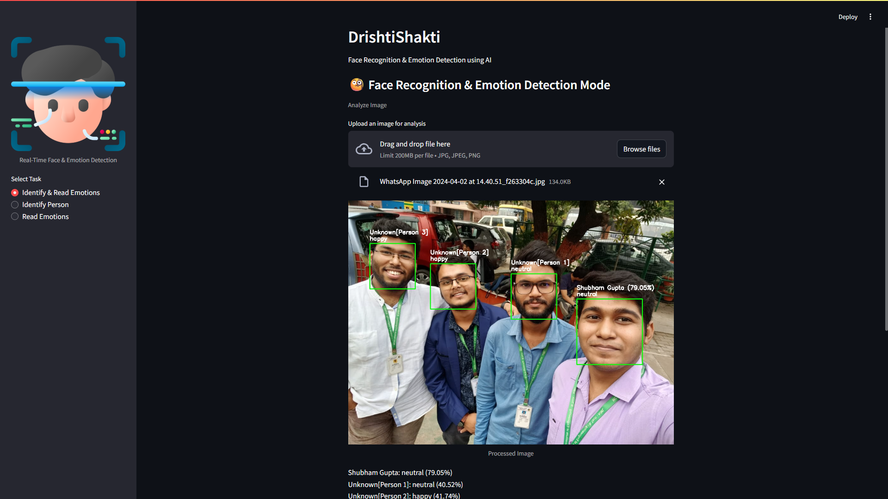
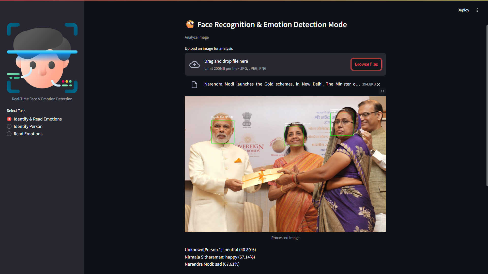

# DrishtiShakti – Face Recognition & Emotion Detection using AI

**Author**: Shubham Gupta  
**College**: MCKV Institute of Engineering  
**Contact**: [shubhamgupta15m@gmail.com](mailto:shubhamgupta15m@gmail.com) | +91 9674644518  

## Project Overview
DrishtiShakti is a real-time vision intelligence system that combines face recognition and emotion detection. Built using Python libraries such as OpenCV, `face_recognition`, and DeepFace, it supports webcam and image upload modes, displaying annotated results with confidence scores.


 

## Features
- Real-time face recognition via webcam or uploaded images
- Emotion detection for recognized faces
- Multi-mode operation: face recognition, emotion detection, or combined
- Dataset crawling and encoding scripts for dataset management
- Confidence percentage display for predictions
- User-friendly Streamlit-based UI

## Environment Setup
DrishtiShakti uses Python 3.8.20 within an Anaconda environment for reproducibility.

### Step 1: Install Anaconda
Download and install Anaconda from: [https://www.anaconda.com/products/distribution](https://www.anaconda.com/products/distribution)

### Step 2: Create and Activate Environment
```bash
conda create -n drishti-env python=3.8.20 -y
conda activate drishti-env
```

### Step 3: Install Dependencies
Create a `requirements.txt` file with the following:
```
face_recognition
opencv-python
joblib
numpy
icrawler
streamlit
deepface
```
Install dependencies:
```bash
pip install -r requirements.txt
```

## Running the Application

### Step 1: Prepare Dataset (Optional)
Collect face images and generate encodings:
```bash
python encode_faces.py
```

### Step 2: Run the Streamlit App
```bash
streamlit run app.py
```

### Step 3: Use the App
- Choose mode: Face Recognition, Emotion Detection, or Combined
- Use webcam or upload images
- View results with bounding boxes, labels, and confidence scores

## Troubleshooting & Tips
- Ensure webcam permissions are granted
- Use good lighting and clear images for better accuracy
- For `face_recognition` issues, install system dependencies (e.g., `cmake`, `dlib`)
- Always work within the `drishti-env` Anaconda environment

## Repository Structure
```
/dataset/           # Face image folders (ignored by git)
/app.py             # Main Streamlit app
/encode_faces.py    # Script for encoding faces
/requirements.txt   # Python dependencies
/README.md          # This document
```

## Contact
📧 [shubhamgupta15m@gmail.com](mailto:shubhamgupta15m@gmail.com)  
📞 +91 9674644518  

## License
This project is licensed under the MIT License.

**Thank you for using DrishtiShakti!** 👁️‍🗨️✨
```